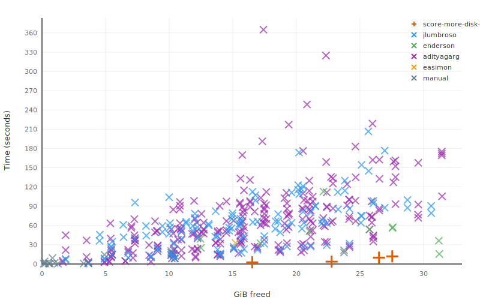

<!--
 Copyright (c) 2026 Contributors to the Eclipse Foundation

 See the NOTICE file(s) distributed with this work for additional
 information regarding copyright ownership.

 This program and the accompanying materials are made available under the
 terms of the Apache License Version 2.0 which is available at
 https://www.apache.org/licenses/LICENSE-2.0

 SPDX-License-Identifier: Apache-2.0
-->

# Comparison with Other Actions

[← Back to README](../README.md)

All major GitHub runner cleanup actions were benchmarked exhaustively across their full parameter space on ubuntu-24.04. The chart below shows the 4 presets of this action (orange `+`) against every measured configuration of the alternatives.

*X axis: GiB freed from root. Y axis: wall-clock time. Lower-left is better. Orange markers are this action's level 1–4 presets.*

---

## Results by Cleanup Tier

### ~16 GiB (Level 1, ~3 s)

| Action | Freed | Duration | GiB/s |
|--------|------:|---------:|------:|
| **more-disk-space level 1** | **16.5 GiB** | **2.6s** | **6.4** |
| jlumbroso (android+dotnet) | 15.1 GiB | 26.7s | 0.56 |
| adityagarg (android+dotnet) | 15.1 GiB | 67.8s | 0.22 |

### ~22 GiB (Level 2, ~4 s)

| Action | Freed | Duration | GiB/s |
|--------|------:|---------:|------:|
| **more-disk-space level 2** | **22.8 GiB** | **3.7s** | **6.2** |
| jlumbroso (android+dotnet+haskell) | 18.7 GiB | 49.4s | 0.38 |
| adityagarg (android+dotnet+haskell) | 18.7 GiB | 20.6s | 0.91 |
| enderson (android+dotnet+haskell, rm) | 17.2 GiB | 32.4s | 0.53 |

### ~26 GiB (Level 3, ~10 s)

| Action | Freed | Duration | GiB/s |
|--------|------:|---------:|------:|
| **more-disk-space level 3** | **26.5 GiB** | **10.0s** | **2.6** |
| enderson (all, rmz) | 31.2 GiB | 15.6s | 2.00 |
| enderson (all, rm) | 31.2 GiB | 36.2s | 0.86 |
| jlumbroso (all) | 26.1 GiB | 98.2s | 0.27 |
| adityagarg (android+dotnet+haskell+large) | 22.7 GiB | 65.0s | 0.35 |

enderson (all) frees ~5 GiB more by also removing tool cache and swap — both [intentionally excluded](#intentionally-excluded) here.

### ~27 GiB (Level 4, ~12 s)

| Action | Freed | Duration | GiB/s |
|--------|------:|---------:|------:|
| **more-disk-space level 4** | **27.5 GiB** | **12.0s** | **2.3** |
| enderson (all, rmz) | 31.2 GiB | 15.6s | 2.00 |
| jlumbroso (all) | 30.6 GiB | 79.2s | 0.39 |
| adityagarg (all) | 27.8 GiB | 93.3s | 0.30 |

---

## Why It's Faster

Three factors, in order of impact:

1. **Files deleted first, APT second** — competing actions drive deletion entirely through `apt-get remove`, which resolves dependencies, validates the transaction, and updates the package index before a single file is touched. This accounts for 30–120 s of overhead. This action deletes files directly via `rmz` first; `apt-get remove` runs afterwards only to clean up package metadata and trigger autoremove of dependents — the slow part is already done.
2. **Hardcoded paths** — deletion targets are known constants on GitHub-hosted runners, so no discovery step is needed.
3. **Parallel I/O via `rmz`** — the slower steps (android-sdk, dotnet) use [`rmz`](https://github.com/SUPERCILEX/fuc) for parallel deletion, which is materially faster than sequential `rm -rf` on large directory trees.

---

## Intentionally Excluded

**Tool cache** (`/opt/hostedtoolcache`, ~6–7 GiB) — removing it forces re-download of Node, Python, Ruby, Go, and Java runtimes, typically adding 5–15 minutes to workflow runtime. Never worth it.

**Swap** — removing swap affects memory availability for the rest of the job.

These are intentionally excluded. If your workflow genuinely needs them removed, [open an issue](https://github.com/eclipse-score/more-disk-space/issues).

---

## easimon (A Different Approach)

[easimon/maximize-build-space](https://github.com/easimon/maximize-build-space) doesn't delete files — it expands workspace by consuming root space via LVM.

In standard mode it leaves near-zero root space (~0.1 GiB), which breaks any subsequent `apt install` or tool download. Max mode avoids the LVM trick but is outperformed at equivalent cleanup sizes.

If a workflow has a genuine need for expanded workspace over freed root space, [open an issue](https://github.com/eclipse-score/more-disk-space/issues).

---

## Raw Data

- Full comparison table: [benchmark/results-others.md](../benchmark/results-others.md)
- Step-selection details: [benchmark/results.md](../benchmark/results.md)
